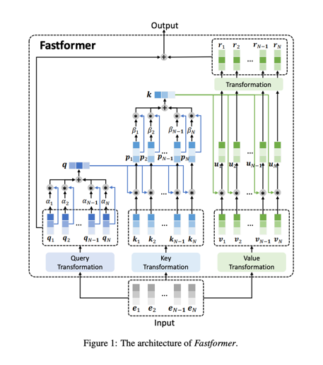

# FastFormer

## A Tensorflow Implementation of Fastformer (Fast Transformer) 

This is a TensorFlow implementation of [Fastformer: Additive Attention Can Be All You Need](https://arxiv.org/abs/2108.09084) by Wu et al. 

**Fastformer** is a Transformer variant that uses _Additive Attention_, a new type of attention based on additive operation rather than multiplicative. This circumvents the quadratic bottleneck that we usually have with attention making it much more efficient. It can achieve comparable or even better results for long sequence modeling performance.

